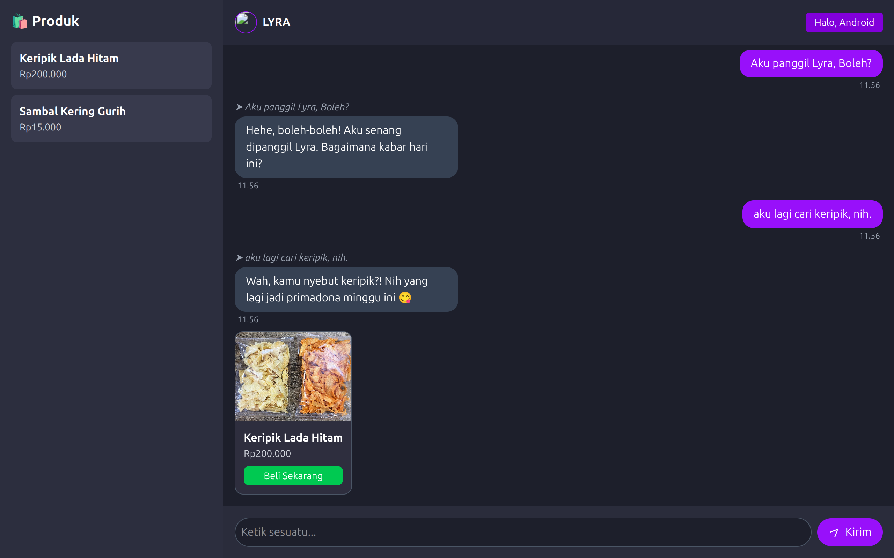
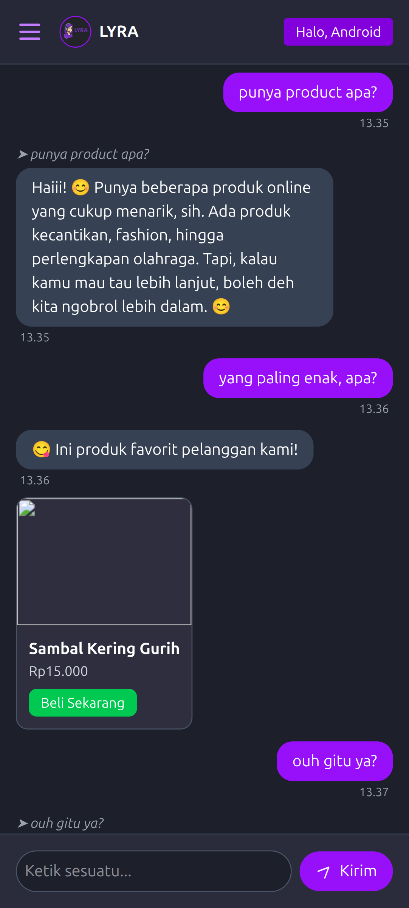

# LYRA AI Chat Commerce 🧠🛍️

LYRA adalah asisten AI modern berbasis web yang dirancang untuk membantu pengguna dalam bentuk percakapan bergaya Telegram. Tak cuma ngobrol, LYRA juga bisa **menawarkan produk toko online secara cerdas**, tampilkan **bubble produk interaktif**, dan **bekerja layaknya CS pintar yang gak capek-capek jualan**.

---

### 🖼️ Screenshot

|            - LYRA -            |
|--------------------------------|
||

[](https://lyra-ai-nine.vercel.app)

## ✨ Fitur Utama

- 🧠 Chat AI (terhubung ke Groq GPT API)
- 💬 UI gaya Telegram dengan bubble reply yang real
- 🛍️ Tampilkan produk otomatis berdasarkan keyword
- 🔐 Login Google via Firebase Auth
- 🚫 Limitasi guest user (3 chat gratis)
- 🪪 Modal login muncul otomatis saat kena limit
- 🖼️ Produk tampil dalam bubble dengan gambar + tombol beli
- 🖱️ Tombol kirim & login pakai icon lucide/heroicons
- 🌓 Dark mode elegan

---

## 🏗️ Teknologi yang Digunakan

- ⚡️ Vite
- 🎨 Tailwind CSS
- 🔥 Firebase (Auth & nanti Firestore)
- 🌐 Groq API (GPT backend)
- 🧩 Modular JS (tanpa framework berat)
- 🦾 Lucide Icons

---

## 📦 Struktur Folder

```pgsql
src/
├── pages/
│ └── ChatTelegram.js # Halaman utama chat
├── modules/
│ ├── authHandler.js # Login Firebase
│ ├── limitModal.js # Modal batas chat
│ ├── intentHandler.js # Deteksi kata niat belanja
│ └── chatRenderer.js # Bubble generator & reply
└── assets/
└── keripik.jpg # Gambar produk dummy
```

---

## 🚀 Setup Lokal

1. Clone repo dan jalankan:
```bash
   git clone https://github.com/daffadevhosting/lyra-ai-chat.git
   cd lyra-ai-chat
   npm install
   npm run dev
```
2. Tambahkan konfigurasi Firebase di `authHandler.js`

## 📌 Roadmap Selanjutnya

 - Simpan chat ke Firestore

 - Produk dari database

 - Voice recognition (mic)

 - Text-to-speech (suara LYRA cewek)

 - Sistem donasi via Xendit

 - Checkout produk langsung via QR code

 ## 💻 Demo

|         - LYRA di hp -         |
|--------------------------------|
||

[LYRA AI-shop](https://lyra-ai-nine.vercel.app) Deployed via vercel

“LYRA bukan sekadar AI, dia CS toko online yang ngerti bahasa manusia dan bisa closing jualan.” – Kita 😎

