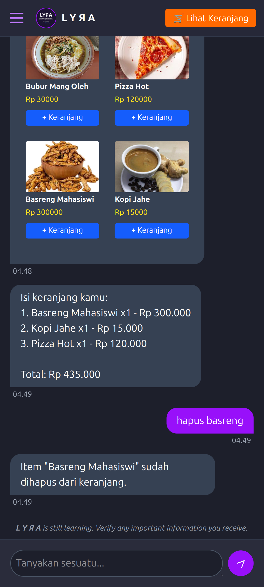

# L Y Я A AI Chat Commerce 🧠🛍️

L Y Я A adalah asisten AI modern berbasis web yang dirancang untuk membantu pengguna dalam bentuk percakapan bergaya Telegram. Tak cuma ngobrol, L Y Я A juga bisa **menawarkan produk toko online secara cerdas**, tampilkan **bubble produk interaktif**, dan **bekerja layaknya CS pintar yang gak capek-capek jualan**. Tinggal tanya, "L Y Я A, punya produk apa?" L Y Я A bakal ngasih katalog.

---

### 🖼️ Screenshot

|            - L Y Я A -            |
|--------------------------------|
||

[](https://lyra-ai-nine.vercel.app)

# 📖 Panduan Cepat Pengguna L Y Я A

L Y Я A adalah chatbot toko online pintar yang siap bantu kamu cari produk dengan gaya ngobrol santai. Yuk, simak cara pakainya:

---

## 🤖 Cara Bertanya

### 📦 Lihat Semua Produk

> **Tanya:** "Punya produk apa aja?", "Katalognya dong"

> **Hasil:** L Y Я A akan kirim daftar semua produk yang tersedia.

### 🔥 Lihat Produk Terlaris

> **Tanya:** "Apa produk terlaris?", "Yang paling banyak dibeli apa?"

> **Hasil:** L Y Я A akan menampilkan produk dengan penjualan terbanyak.

### 🌟 Lihat Produk dengan Rating Tertinggi

> **Tanya:** "Produk paling enak?", "Yang ratingnya paling tinggi apa?"

> **Hasil:** L Y Я A akan tampilkan produk dengan bintang tertinggi.

### 🔍 Cari Produk Spesifik

> **Tanya:** "Ada keripik singkong?", "Punya bubur mang oleh ga?"

> **Hasil:** L Y Я A akan mencocokkan nama/kata kunci dengan katalog produk.

### 🙋 Tanya Hal Lain

> **Tanya:** "Cara jadi reseller gimana?", "buka keranjang belanjaku", "Bisa kirim ke luar kota?"

> **Hasil:** L Y Я A akan jawab secara umum atau kasih saran.

---

## ⚠️ Batasan Fitur

* Tanpa login: Maksimal 10 chat/hari.
* Login User: 50 chat/hari.
* Ingin akses penuh? Hubungi admin!

---

## 📦 Tips Tambahan

* Klik produk di sidebar untuk tanya langsung ke L Y Я A.
* Pakai kata kunci umum seperti "keripik", "sambal", "kopi" untuk hasil terbaik.
* L Y Я A bakal makin pintar seiring waktu, jadi terus coba aja ya 😉

---

Selamat berbelanja bareng L Y Я A! 💜

> Dibuat oleh nDang & Daffa, manusia nyeleneh dari Tasik.


## ✨ Fitur Utama

- 🧠 Chat AI (terhubung ke Groq GPT API)
- 💬 UI gaya Telegram dengan bubble reply yang real
- 🛍️ Tampilkan produk otomatis berdasarkan keyword
- 🔐 Login Google via Firebase Auth
- 🚫 Limitasi guest user (10 chat gratis)
- 🪪 Modal login muncul otomatis saat kena limit
- 🖼️ Produk tampil dalam bubble dengan gambar + tombol beli
- 🖱️ Tombol kirim & login pakai icon lucide/heroicons
- 🌓 Dark mode elegan

---

## 🏗️ Teknologi yang Digunakan

- ⚡️ Vite
- 🎨 Tailwind CSS
- 🔥 Firebase (Auth & nanti Firestore)
- 🌐 Groq API (GPT backend)
- 🧩 Modular JS (tanpa framework berat)
- 🦾 Lucide Icons

---

## 📦 Struktur Folder

```pgsql
src/
├── pages/
│ └── ChatTelegram.js # Halaman utama chat
├── modules/
│ ├── authHandler.js # Login Firebase
│ ├── limitModal.js # Modal batas chat
│ ├── intentHandler.js # Deteksi kata niat belanja
│ └── chatRenderer.js # Bubble generator & reply
└── assets/
└── keripik.jpg # Gambar produk dummy
```

---

## 🚀 Setup Lokal

1. Clone repo dan jalankan:
```bash
   git clone https://github.com/daffadevhosting/lyra-ai-chat.git
   cd lyra-ai-chat
   npm install
   npm run dev
```
2. Tambahkan konfigurasi Firebase di `authHandler.js`

## 📌 Roadmap Selanjutnya

 - Simpan chat ke Firestore

 - Voice recognition (mic)

 - Text-to-speech (suara L Y Я A cewek)

 - Produk dari database **(Done)**

 - Checkout produk langsung via AI **(Done)**

 - Sistem payment via XENDit **(Done)**


 ## 💻 Demo

|         - L Y Я A di hp -         |
|--------------------------------|
||

[L Y Я A AI-shop](https://lyra-ai-nine.vercel.app) Deployed via vercel

“L Y Я A bukan sekadar AI, dia CS toko online yang ngerti bahasa manusia dan bisa closing jualan.” – Kita 😎

